# Submission Document - HW5 - Mitchell Ergen
---
For this week, create a new SUBMISSION.md file in your repo. Add the images to a new figures
directory and add links to those images to the SUBMISSION.md file. The images you need are:

- [x] 5 pts Your Github account showing that is has been forked from the depaulcdm/springpetclinic repository.
    - 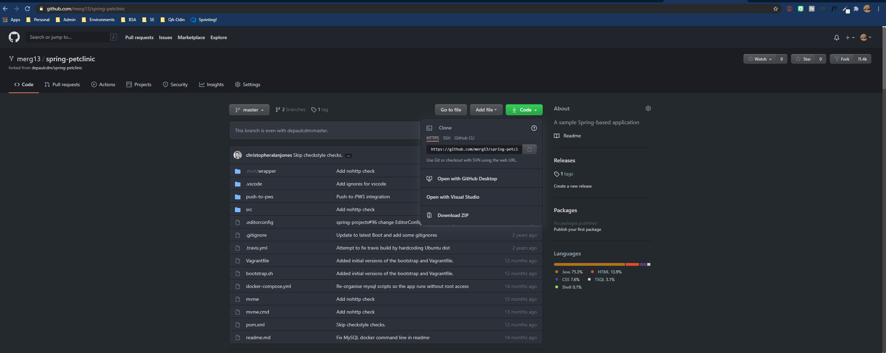
- [x] 5 pts Your Travis CI dashboard showing a successful first build.
    - 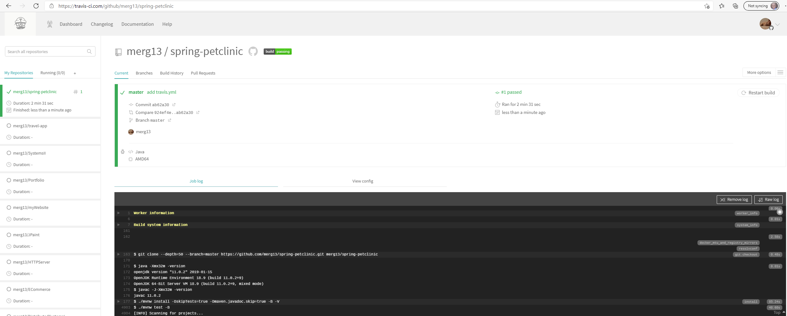
- [x] 5 pts The section of the POM file showing the coordinates after you’ve changed them.
    - 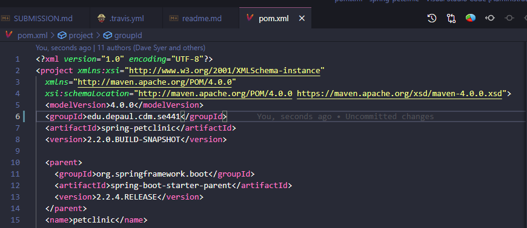
- [x] 5 pts Your Travis CI dashboard showing a successful build after your change of the group
ID.
    -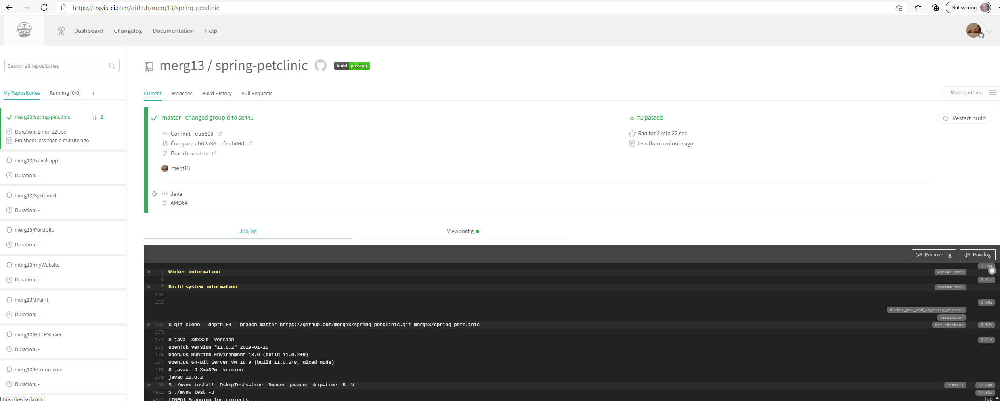
- [X] 5 pts The section of the POM file showing the coordinates after you’ve commented them
out.
    -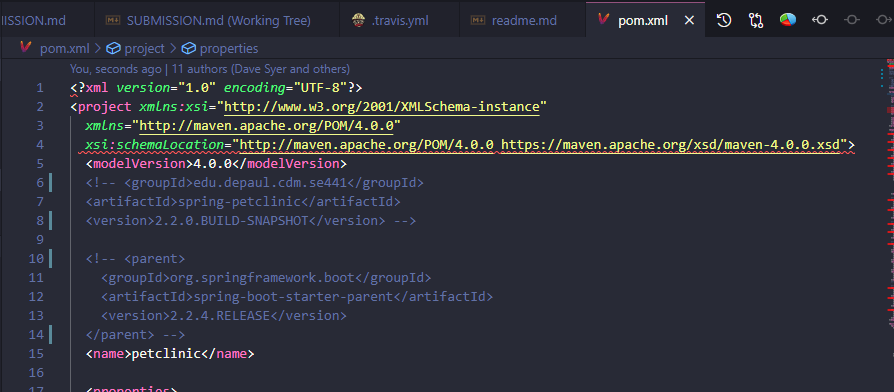
- [X] 5 pts Your Travis CI dashboard showing the unsuccessful build after the breaking change.
    -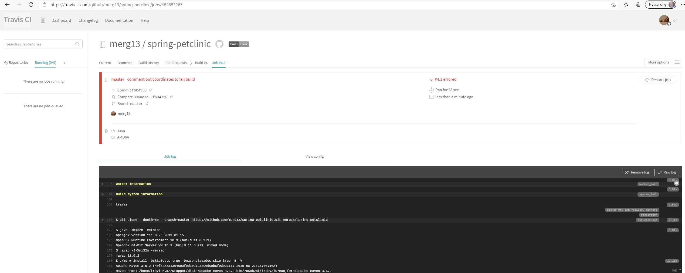
- [X] 5 pts Your Github repository with the readme.md file selected showing the build failed
status after the Travis CI build fails.
    - Local Repo [`readme.md`](readme.md) error
      - 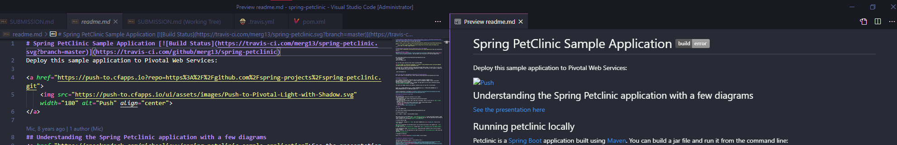
    - Remote Repo [`readme.md`](https://github.com/merg13/spring-petclinic) error
      - 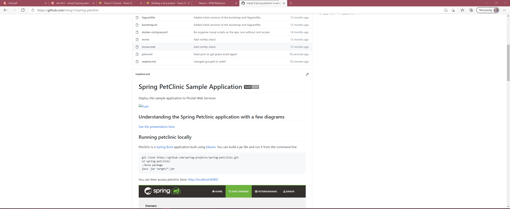

- [X] 5 pts The section of the POM file showing the coordinates after you’ve fixed them.
    -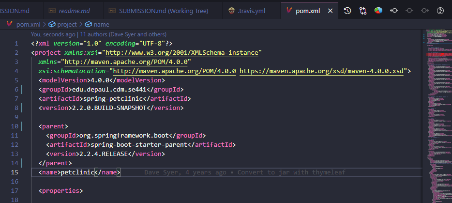

- [x] 5 pts Your Travis CI dashboard showing the successful build after the breaking change has
been fixed.
    -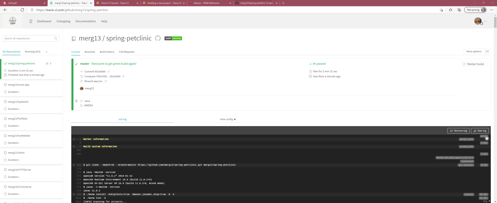

- [X] 5 pts Your Github repository with the readme.md file selected showing the build success
status after the Travis CI build has recovered.
    - Local Repo [`readme.md`](readme.md)
      - 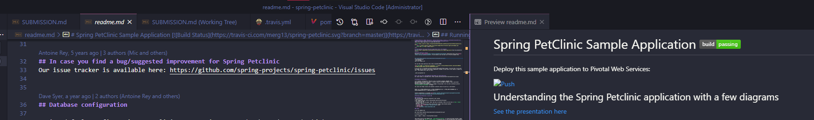
    - Remote Repo [`readme.me`](https://github.com/merg13/spring-petclinic)
      - 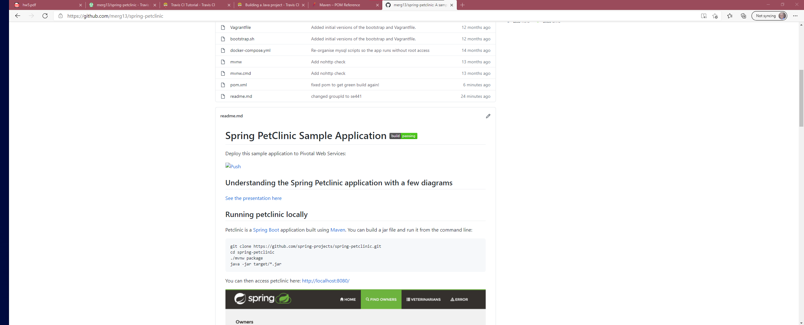
- [X] Submit a link to your repository in D2L. Make sure your Github repository is public.
